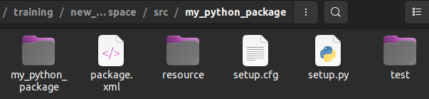
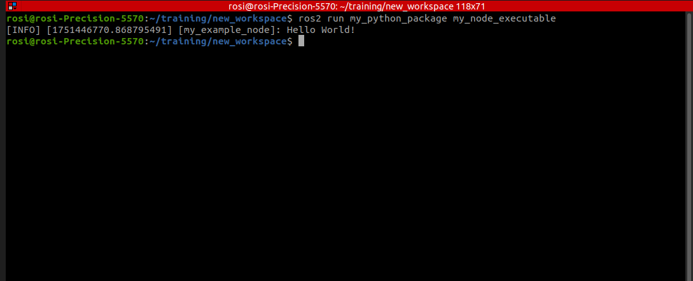
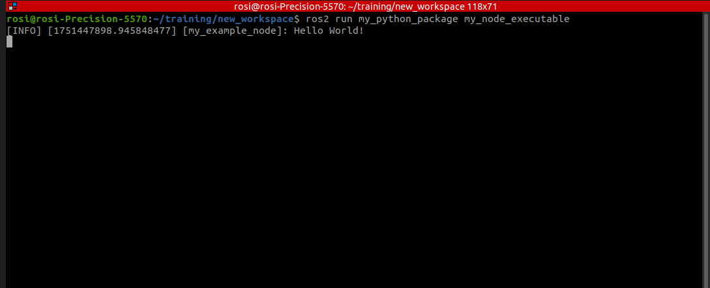
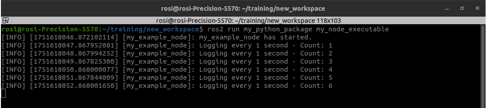
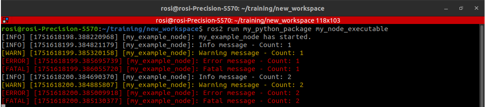

# Practice 2: Create a ROS 2 Node (Python)

In this practice, you will create a basic ROS 2 node using Python. A node is a fundamental building block in ROS 2 that allows your program to communicate with other parts of a robotic system. This exercise will help you understand how to define, initialize, and run a node, laying the groundwork for more complex ROS 2 applications.

## Mandatory Exercises:

Complete this section to achieve the core learning objectives related to ROS2 nodes.

1. **Practice 2A: Creating ROS 2 Nodes**
   - [2A.1: Creating a ROS 2 Node](#2a1-creating-a-ros-2-node)  
   
2. **Practice 2B: Working with ROS 2 Nodes (Python)**
   - [2B.1: Creating an Executable ROS 2 Node](#2b1-creating-an-executable-ros-2-node)  
   - [2B.2: Spinning a ROS2 Node](#2b2-spinning-a-ros2-node)  
   - [2B.3: Implementing ROS2 Node using OOP](#2b3-implementing-ros2-node-using-oop)  
   - [2B.4: ROS2 Node Timers](#2b4-ros2-node-timers)  
   - [2B.5: Different Types of ROS2 Loggers](#2b5-different-types-of-ros2-loggers)

## Additional Exercises (Optional):

Do these if you want to go further or explore more features of node implementation.

3. **Practice 2C: Querying Information about ROS2 Nodes**

   - [2C.1: Querying Information about ROS2 Nodes](#2c1-querying-information-about-ros2-nodes) 

## Background

  
<br> 

Each node in ROS should be responsible for a single, modular purpose, e.g. controlling the wheel motors or publishing the sensor data from a laser range-finder. Each node can send and receive data from other nodes via topics, services, actions (not covered in this course), or parameters.

## Learning Outcomes

By the end of this practice, you will be able to:
- Understand the role and structure of ROS 2 nodes.
- Create and execute a basic ROS 2 Python node.
- Use object-oriented programming (OOP) to organize node functionality.
- Implement node timers and control execution intervals.
- Utilize different ROS 2 logging levels for debugging and status reporting.
- Inspect node behavior using ROS 2 CLI tools (e.g., publishers, subscriptions).

## Prerequisites
-  Please ensure that you have created the `my_python_package` file in the previous practical (Practice 1).


## 2A.1: Creating a ROS 2 Node

In a ROS 2 package, there can be multiple ROS 2 nodes, each serving a specific function. These nodes can work independently or communicate with each other through topics, services, and parameters. In this exercise, you will create a ROS 2 node using the my_python_package that you set up in the previous exercise. To create a ROS 2 node in Python:

1. Go to `my_python_package` module directory.
```bash
cd ~/training/new_workspace/src/my_python_package/my_python_package
```

2. Create a python script named `my_node.py`
```bash
code my_node.py
```
 The command above will create a Python script named `my_node.py` file and launch it on Visual Studio Code. 
 
**Note: If you do not have Visual Studio Code, please install it**


3. Below is a basic Python ROS 2 node template. This simple node initializes ROS 2, logs a message, and then shuts down.
**Copy** the script below and paste it into the file `my_node.py`.

```python
import rclpy
from rclpy.node import Node

def main (args = None):
   rclpy.init(args=args)
   node = Node("my_example_node")
   node.get_logger().info('Hello World!')
   rclpy.shutdown()

if __name__ == '__main__':
   main()
```
- Once you have finished coding, please remember to save the file. 


**Explanation**
- `import rclpy` : In this line, the rclpy library is imported, which is the ROS2 standard Python library.
- `from rclpy.node import Node` : In this line , the Node class is imported from the rclpy library.
- `rclpy.init(args=args)` : In this line , the ROS2 python client library is initialised.
- `node = Node("my_example_node")` : In this line , a ROS2 node with the name "my_example_node" is created.
- `rclpy.shutdown()` : In this line, the ROS2 system is shutdown. 

## 2B.1: Creating an Executable ROS 2 Node

1. Open the setup.py file in your my_python_package directionary

  
<br> 

You can execute a command (shown below) to open `setup.py` in Visual Studio Code

``` bash
code ~/training/new_workspace/src/my_python_package/setup.py 
 ```

2. Creating instructions to build executable

The following line should be added within the console_scripts brackets of the entry_points field:

``` python
'my_node_executable = my_python_package.my_node:main'
 ```
**Explanation**
- `my_node_executable` : This is the executable name.
- `my_python_package` : This is the folder containg the python node script.
- `my_node` :  Name of the python script.
- `main`: Name of the function.

Your `setup.py` should be something like this:

```python
from setuptools import find_packages, setup

package_name = 'my_python_package'

setup(
    name=package_name,
    version='0.0.0',
    packages=find_packages(exclude=['test']),
    data_files=[
        ('share/ament_index/resource_index/packages',
            ['resource/' + package_name]),
        ('share/' + package_name, ['package.xml']),
    ],
    install_requires=['setuptools'],
    zip_safe=True,
    maintainer='johnaa',
    maintainer_email='john_abogado@artc.a-star.edu.sg',
    description='TODO: Package description',
    license='TODO: License declaration',
    tests_require=['pytest'],
    entry_points={
        'console_scripts': [
             'my_node_executable = my_python_package.my_node:main'
        ],
    },
)
```

3. Build ROS2 Package `my_python_package`

Go back to the root of your workspace. Enter the following command in your linux terminal
```linux
cd ~/training/new_workspace
colcon build --packages-select my_python_package
```
-  `colcon build --packages-select my_python_package` : This command line is used to build `my_python_package` specifically.

4. Sourcing your workspace

- Enter the following command in your linux terminal
```linux
source install/setup.bash
```
- `source install/setup.bash` : This command line is used to source the script
  - In order to use packages in your workspace, you need to source the workspace's setup script.

5. Running the executable
```linux
ros2 run my_python_package my_node_executable
```

6. Verify Output

- The output of your program should look like the picture below.

  
<br> 

## 2B.2: Spinning a ROS2 Node

This example demonstrates how to spin a basic ROS 2 node in Python. Spinning a node allows it to process incoming events, callbacks, and keep running until it is shut down. The example node logs a simple "Hello World!" message to indicate it is active.

1. Add the `rclpy.spin(node)` line to `my_node.py` script.

```python
import rclpy
from rclpy.node import Node

def main (args = None):
   rclpy.init(args=args)
   node = Node("my_example_node")
   node.get_logger().info('Hello World!')
   rclpy.spin(node)
   rclpy.shutdown()

if __name__ == '__main__':
   main()
```

**Explanation**

- `rclpy.spin(node)` : Keeps the node alive and responsive to callbacks and events until shutdown.  


2. Rebuild the package and execute the script.

The output of your program should look like the picture below.

  
<br> 


**Question:**  
What do you think will happen if the **logging statement** is executed *after* the `rclpy.spin(node)` call instead of before it? Try it!

## 2B.3: Implementing ROS2 Node using Object-Oriented Programming (OOP)

This example shows how to implement a ROS 2 node in Python using Object-Oriented Programming (OOP) principles. By defining a class that inherits from the ROS 2 `Node` class, we encapsulate the node's behavior and data, making the code more modular, reusable, and easier to maintain.

```python
import rclpy
from rclpy.node import Node

class MyExampleNode(Node):
    def __init__(self):
        super().__init__('my_example_node')
        self.get_logger().info('my_example_node using OOP has started.')

def main(args=None):
    rclpy.init(args=args)
    node = MyExampleNode()
    rclpy.spin(node)
    rclpy.shutdown()

if __name__ == '__main__':
    main()
```

**Explanation**

1. `class MyExampleNode(Node)` : Defines a custom ROS 2 node by inheriting from the `Node` class.  
2. `super().__init__('my_example_node')` : Initializes the node with the name `"my_example_node"` by calling the parent class constructor.  
3. `self.get_logger().info('my_example_node using OOP has started.')` : Logs an informational message using the ROS 2 logging system.  
7. `node = MyExampleNode()` : Creates an instance of the custom ROS 2 node.  

## 2B.4: ROS2 Node Timers

This example demonstrates how to use timers within a ROS 2 node implemented in Python. Timers allow you to execute a callback function periodically at a fixed interval, which is useful for tasks like publishing sensor data, checking system status, or performing regular computations within the node.

```python
import rclpy
from rclpy.node import Node

class MyExampleNode(Node):
    def __init__(self):
        super().__init__('my_example_node')
        self.counter = 0
        self.timer = self.create_timer(1.0, self.timer_callback)
        self.get_logger().info('my_example_node has started.')

    def timer_callback(self):
        self.counter += 1
        self.get_logger().info(f'Logging every 1 second - Count: {self.counter}')

def main(args=None):
    rclpy.init(args=args)
    node = MyExampleNode()
    rclpy.spin(node)
    rclpy.shutdown()

if __name__ == '__main__':
    main()
```

**Explanation**

1. `self.counter = 0` : In this line, a counter variable is initialized to keep track of how many times the timer has fired.
2. `self.timer = self.create_timer(1.0, self.timer_callback)` : In this line, a timer is created that calls the `timer_callback` method every 1 second.
3. `def timer_callback(self):` : In this line, the callback function that is triggered by the timer is defined.
4. `self.counter += 1` : In this line, the counter is incremented each time the timer callback is executed.
5. `self.get_logger().info(f'Logging every 1 second - Count: {self.counter}')` : In this line, a log message is printed every second with the current count.

- The output of your program should look like the picture below.

  
<br> 


## 2B.5: Different Types of ROS2 Loggers

This section explores the various logging levels available in ROS 2, such as DEBUG, INFO, WARN, ERROR, and FATAL. Using different logger types helps you categorize the importance of messages, making it easier to monitor node behavior and debug your application effectively.

```python
import rclpy
from rclpy.node import Node

class MyExampleNode(Node):
    def __init__(self):
        super().__init__('my_example_node')
        self.counter = 0
        self.timer = self.create_timer(1.0, self.timer_callback)
        self.get_logger().info('my_example_node has started.')

    def timer_callback(self):
        self.counter += 1
        self.get_logger().debug(f'Debug message - Count: {self.counter}')
        self.get_logger().info(f'Info message - Count: {self.counter}')
        self.get_logger().warn(f'Warning message - Count: {self.counter}')
        self.get_logger().error(f'Error message - Count: {self.counter}')
        self.get_logger().fatal(f'Fatal message - Count: {self.counter}')

def main(args=None):
    rclpy.init(args=args)
    node = MyExampleNode()
    rclpy.spin(node)
    rclpy.shutdown()

if __name__ == '__main__':
    main()
```

- The output of your program should look like the picture below.

  
<br> 

## 2C.1: Querying Information about ROS2 Nodes

In this section, you will learn how to inspect and query information about active ROS 2 nodes using command-line tools. 

1. Run the `my_node_executable` from `my_python_package`

```bash
ros2 run my_python_package my_node_executable
```

2. Open another terminal panel by pressing the top-left button of your terminal, **or** launching a new terminal by `ctrl` + `alt` + `T`

3. Execute the following command:

```bash
ros2 node list
```
You should be able to see the following output.

```linux
/my_example_node
```

The command `ros2 node list` displays a list of all active ROS 2 nodes currently running in the system. Each node represents a separate process, and this command helps you verify which nodes are up and communicating. It’s especially useful for debugging, monitoring, and ensuring your nodes have been launched successfully.

4. To query information about the node running, `/my_example_node`. Execute the following command:

```bash
ros2 node info /my_example_node
```

You should be able to see the following output:

```linux
/my_example_node
  Subscribers:

  Publishers:
    /parameter_events: rcl_interfaces/msg/ParameterEvent
    /rosout: rcl_interfaces/msg/Log
  Service Servers:
    /my_example_node/describe_parameters: rcl_interfaces/srv/DescribeParameters
    /my_example_node/get_parameter_types: rcl_interfaces/srv/GetParameterTypes
    /my_example_node/get_parameters: rcl_interfaces/srv/GetParameters
    /my_example_node/list_parameters: rcl_interfaces/srv/ListParameters
    /my_example_node/set_parameters: rcl_interfaces/srv/SetParameters
    /my_example_node/set_parameters_atomically: rcl_interfaces/srv/SetParametersAtomically
  Service Clients:

  Action Servers:

  Action Clients:
```