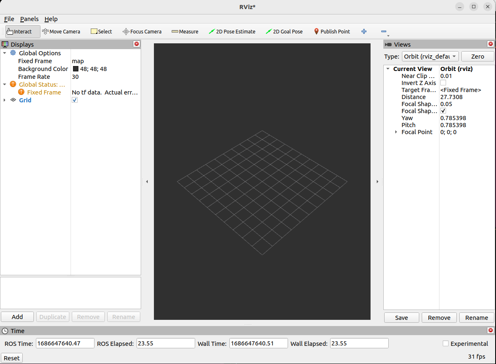
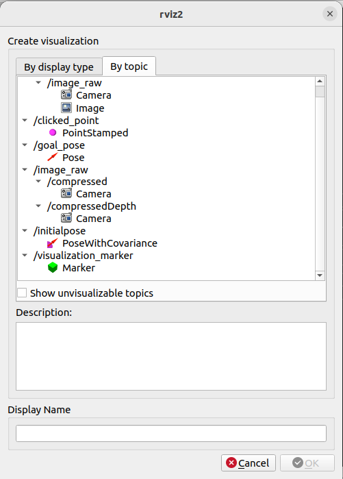
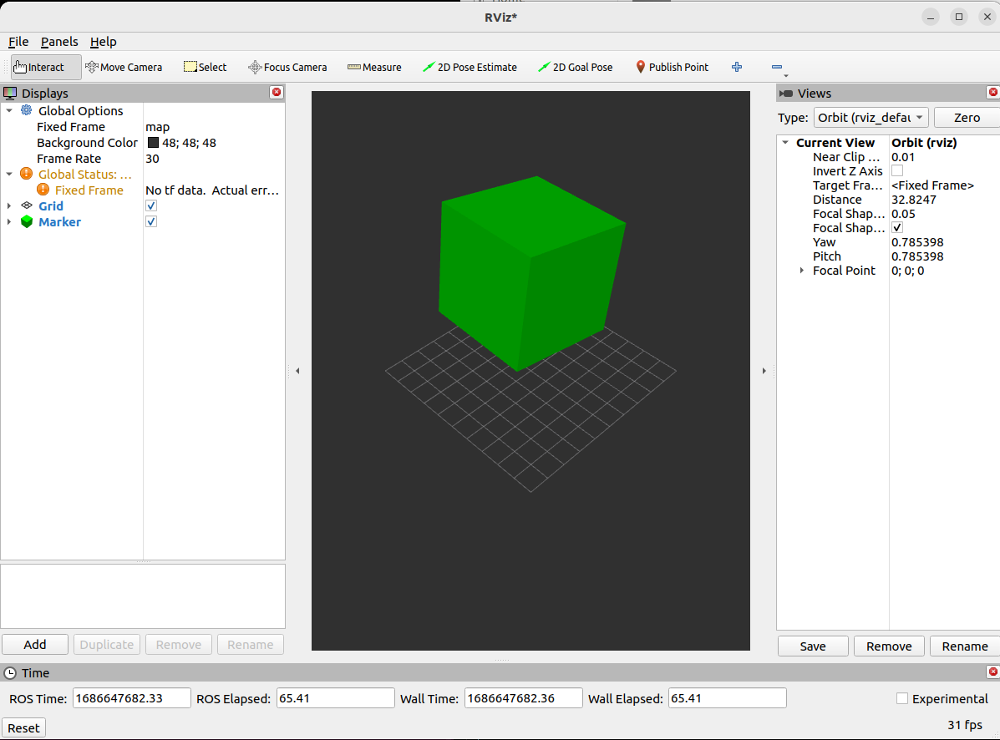

# Creating ROS2 Service Client

In this practice, you will build upon the custom service interface created in Practical 8. You will create a new ROS 2 package that includes a service client node. This client will call the custom service provided by the Aruco detection server to request and retrieve the pose of a detected Aruco marker. Upon receiving the response, the client will print the pose information position and orientation of the marker to the terminal. This exercise will reinforce your understanding of how ROS 2 service clients operate, how to interact with existing service servers, and how to process structured data returned from service calls.

## Learning Outcomes

By the end of this practice, learners will be able to:

- Understand the client-server communication model in ROS 2 using services
- Implement a ROS 2 Service Client node that sends requests to a service and handles responses
- Use custom or built-in service types to structure request and response data
- Write client logic that waits for service availability before sending a request
- Interpret and process the response data returned by the service server
- Use ROS2 visualisation tools

1. **Practice 8A: Creating a ROS2 Service Client**

   - [9A.1: Creating a Service Client](#9a1-creating-a-service-client)
   - [9A.2: Verifying your Service Client](#9a2-verifying-your-service-client)


## 9A.1: Creating a Service Client

1. Create a ROS 2 package named `object_spawner`

2. Create a ROS 2  executable in this package named `object_spawner_node`

    - You may use the provided boiler plate code below as a starting point for your code. This file contains the `ObjectSpawnerNode` class to be the Node based object where you will create your client. 

    ```python
    import rclpy
    from rclpy.node import Node

    class ObjectSpawnerNode(Node):
        def __init__(self):
            super().__init__('object_spawner_node')

            #------------------------------------------------
            #                    TODO:
            #  Create your Service Client here! Remember to check
            #  what is the Client type you need.
            #------------------------------------------------


        def send_request(self):

            #------------------------------------------------
            #                    TODO:
            #  Populate the send_request function.This is where you should craft your 
            #  request and read the response to be passed to the publish_markers function
            #  In the publish_markers fuction do the follwoing 

            # Set the pose of the marker

            # set shape, Arrow: 0; Cube: 1 ; Sphere: 2 ; Cylinder: 3

            # Set the scale of the marker

            # Set the color

            #------------------------------------------------
            
    def main():
        rclpy.init()
        node = ObjectSpawnerNode()
        while rclpy.ok():
            node.send_request()
        node.destroy_node()
        rclpy.shutdown()


    if __name__ == '__main__':
        main()
    ```

    
3. Create a ROS 2 Service **Client** to retrieve the **pose** of the Aruco Marker detected. 

4. Fill up the `send_request` function with the appropriate codes so that the client calls is able to retrieve the pose from the server and print out the pose of the Arucuo tags

## 9A.2: Verifying your Service Client

Before doing this. **REMEMBER TO BUILD AND SOURCE YOUR WORKSPACE**

To check if your solution works, run the following 

### 1. Run the camera driver on the turtlebot3
Before running the camera driver, ensure that you have **CONNECTED TO THE SAME NETWORK AS YOUR TURTLEBOT AND EXPORTED THE `ROS_DOMAIN_ID` IN YOUR ENVIRONMENT**
```bash
ssh ubuntu@<ip_address>

ros2 launch camera_calibration_pkg camera_calibration.launch.py 

```

### 2. Run your image viewer node

In another terminal within your VM, ensure that you have **SOURCED YOUR ROS DISTRO AND YOUR WORKSPACE AND EXPORTED THE `ROS_DOMAIN_ID` IN YOUR ENVIRONMENT**, then run the following command:

```bash
ros2 run camera_service aruco_detection_node
```

### 3. Run your newly created service client

In another terminal within your VM, ensure that you have **SOURCED YOUR ROS DISTRO AND YOUR WORKSPACE AND EXPORTED THE `ROS_DOMAIN_ID` IN YOUR ENVIRONMENT**, then run the following command:

```bash
ros2 run object_spawner object_spawner_node
```
You should now see a printed pose representing the location of the Aruco tag


### 4. Run RViz. you should see a windowed GUI client appear with an empty world

In another terminal within your VM, ensure that you have **SOURCED YOUR ROS DISTRO AND YOUR WORKSPACE AND EXPORTED THE `ROS_DOMAIN_ID` IN YOUR ENVIRONMENT**, then run the following command:

```bash
rviz2
```

#### Click on the `Add` button at the bottom left corner to add the visualization


<br>

#### Select the visualization `By topic`, `/visualization_marker`

<br>

#### You should now see the cube in the scene

<br>


