# ROS Industrial Consortium Asia Pacific: ROS2 Basics PC Set-up Instructions
This file contains the setup instructions for your PC for the ROS-Industrial ROS 2 Basics Course. It is designed to help participants set up and prepare their system to be ready for the course activities and exercises.

1. **PC Specfication**
   - [Minimum System Requirements](#minimum-system-requirements)  

2. **Virtual Machine Installation**
   - [Install Oracle VirtualBox and its Extension Pack](#install-oracle-virtualbox-and-its-extension-pack)
   - [Download ROS2 Basics Training Image](#download-ros2-basics-training-image)
   - [Setting up the ROS2 Basics Training Image](#setting-up-the-ros2-basics-training-image)
   - [Verification of Virtual Machine](#verification-of-virtual-machine)

3. **Additional Installation on Virtual Machine**
   - [Visual Studio Code](#visual-studio-code)
   - [Terminator](#terminator) 

4. **Maximising Virtual Machine Performance**
    - [Increasing CPU and RAM Allocation](#increasing-cpu-and-ram-allocation)

## Minimum System Requirements

To run the ROS2 Basics 2025 virtual environment smoothly, your system must meet the following minimum requirements.

| Component             | Specification                             |
|-----------------------|-------------------------------------------|
| **Processor (CPU)**   | 11th Gen Intel® Core™ i5 Series           |
| **GPU**               | Nvidia GeForce GTX 1060                   |
| **RAM**               | 16.0 GB                                   |
| **System Type**       | 64-bit OS, x64-based processor            |
| **Operating System**  | Windows 11 (Preferred) / Windows 10       |
| **Storage**           | At least 40 GB free space                 |

## Install Oracle VirtualBox and its Extension Pack

This step is **mandatory** for participating in the course. You must install **Oracle VirtualBox**, the **VirtualBox Extension Pack**, and download the provided **ROS2 Basics 2025 OVA file**. These components ensure that you have a pre-configured and consistent development environment, allowing you to focus on learning ROS 2 without setup issues.

Download Oracle `VirtualBox Package` and `VirtualBox Extension Pack` using the link below, selecting the appropriate version based on your PC’s operating system (Windows or Linux).

[Oracle Virtual Box](https://www.virtualbox.org/wiki/Downloads)
<br>
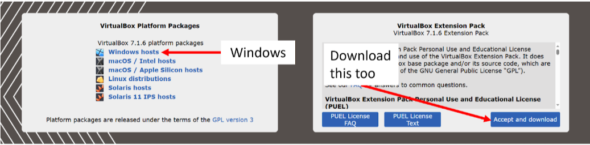
<br>

**Note** : The version of VirtualBox shown in the image may differ from the version you have installed.

## Download ROS2 Basics Training Image

Next, download the Training Image (.ova) file that we will be using for this course here:

[ROS2 Basics OVA File](https://nav2-training-image.s3.ap-southeast-1.amazonaws.com/ROS2+Basics+Humble+2025.ova)


## Setting up the ROS2 Basics Training Image

Import the ROS-Industrial: Introduction to ROS2 Basics Training Image, `ROS2+Basics+Humble+2025.ova`

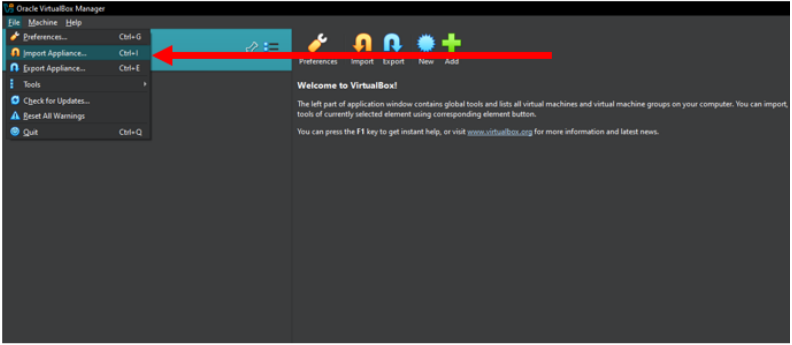
<br>

Before running your virtual machine, check the settings for the network adapter
Under `Expert` settings, go to `Network`, and ensure that it is using the `Bridged Adapter`.

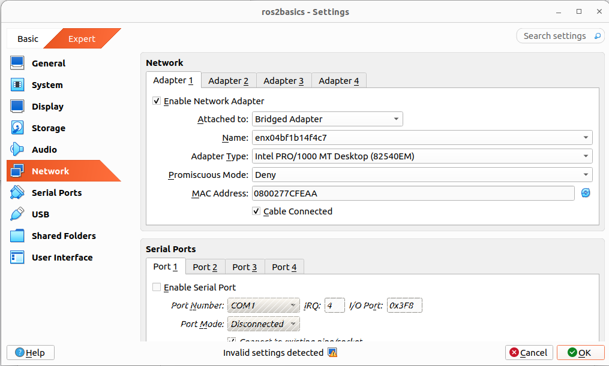
<br>

Next, as we are going to use external devices such as your webcams for some exercises, we need to enable the USB sharing!
Under settings, go to `USB` and ensure that `Enable USB Controller` and `USB 3.0 (xHCI) Controller` are checked.
Proceed to click the add button on your right panel and add the relevant USBs that we allow the VM to access.

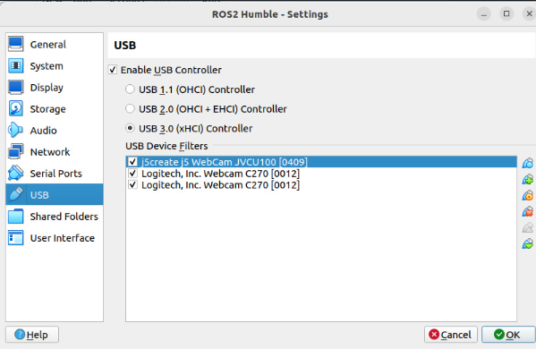
<br>


Go to `General` -> `Advanced` to allow clipboard sharing, this allows you to copy and paste text from your PC to VM.

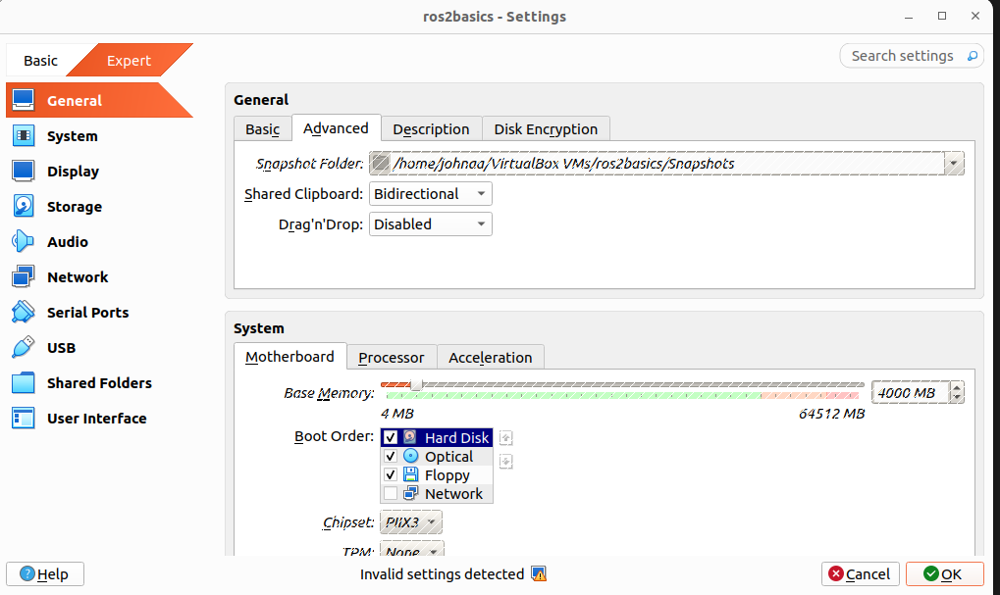
<br>

Next, Enable the Mini Toolbar. Tick all boxes

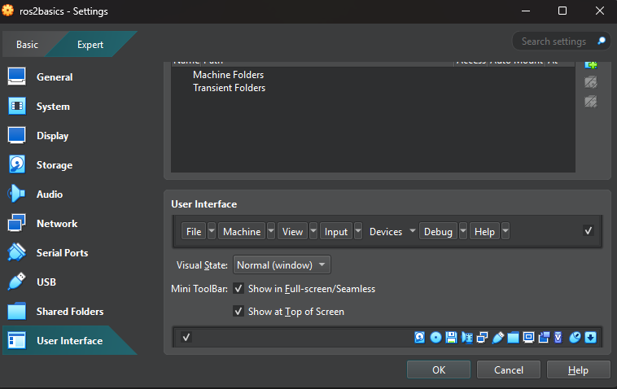
<br>

**It is recommended to restart your PC before starting the ROS2 Basics Image!**

Click Ok and run the Virtual Machine by pressing Start. The table below shows the `username` and `password`.

| Field            | Value        |
|------------------|--------------|
| **username**     | `rosi-ap`    |
| **password**     | `123`        |

If all are in order, you should be able to see this screen upon start-up! 

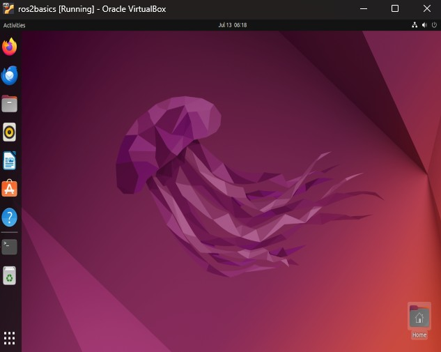
<br>


Install `VM Guest Additions` to enable features such as drag-and-drop, copy-and-paste text, and shared folders between your host system and the virtual machine. Additionally, install the `OpenSSH server` and `net-tools` to allow secure remote connections and network troubleshooting to your virtual machine.

Within the image, open terminal by `ctrl` + `alt` + `T` and execute the following command

```bash
sudo apt install openssh-server
sudo apt install net-tools
sudo apt install build-essential dkms linux-headers-$(uname -r)
```

From the top left corner of the VM window, go to `Devices` -> `Insert Guest Additions CD image...`
A CD icon will then appear on the taskbar of your Linux virtual machine.
Double click on it and you will see this window, similar to the image below.
Right click on `.autorun.sh` and click `Run as a Program` to begin installation.

If you do not see the `Devices` menu, it likely means the Virtual Machine was imported before the `VirtualBox Extension Pack` was installed.  
To fix this, delete the current virtual machine image and **re-import** it after installing the `VirtualBox Extension Pack`.


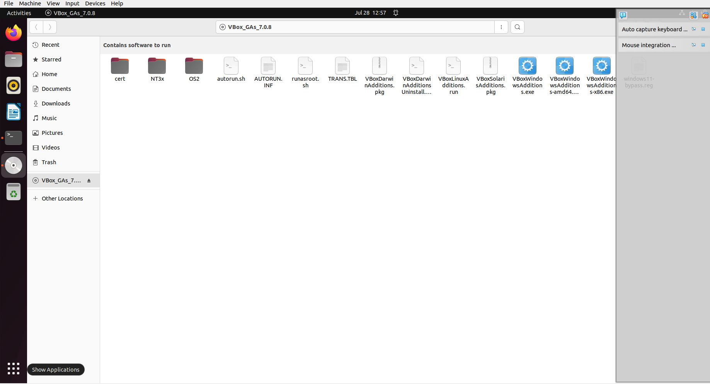
<br>

Once done, you should see the following output in terminal 

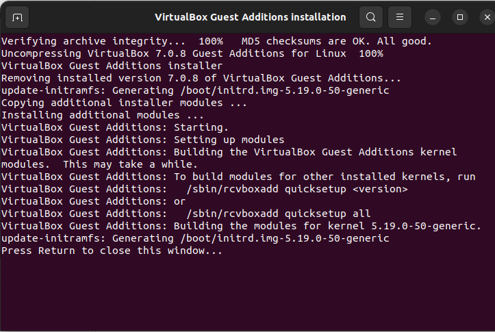
<br>

**REBOOT** your Virtual Machine!

**IF THIS IS STILL NOT WORKING**
You need to:
1. Logout of your user and run Ubuntu on Xorg
2. Do a `sudo nano/etc/gdm3/custom.conf`
3. Uncomment the line on `Wayland`
4. Do a `sudo systemctl restart gdm3`
5. Logout and log back in

If the virtual machine screen is too small for you, change to full-screen or scale mode. Execute the same respective hotkey to undo.

| **Mode**        | **Shortcut Key**       |
|-----------------|------------------------|
| Full-Screen     | `Host` + `F` (e.g., `Right Ctrl` + `F`) |
| Scale Mode      | `Host` + `C` (e.g., `Right Ctrl` + `C`) |


## Verification of Virtual Machine

This section helps you confirm that all required tools, environments, and configurations have been installed correctly.

**Note: When copying a line to/from terminal, use these commands**

| **Action**              | **Shortcut Key**          |
|-------------------------|---------------------------|
| Copy from Terminal      | `Ctrl` + `Shift` + `C`     |
| Paste into Terminal     | `Ctrl` + `Shift` + `V`     |

> **Note:** These shortcuts apply to most Linux terminal emulators within the virtual machine.


1. Let's run the Turtlebot3 Simulation!

```bash
cd ~/ros2basics_ws
source install/setup.bash
export TURTLEBOT3_MODEL=burger
ros2 launch turtlebot3_gazebo empty_world.launch.py
```
2. You should be able to see the simulation (below)

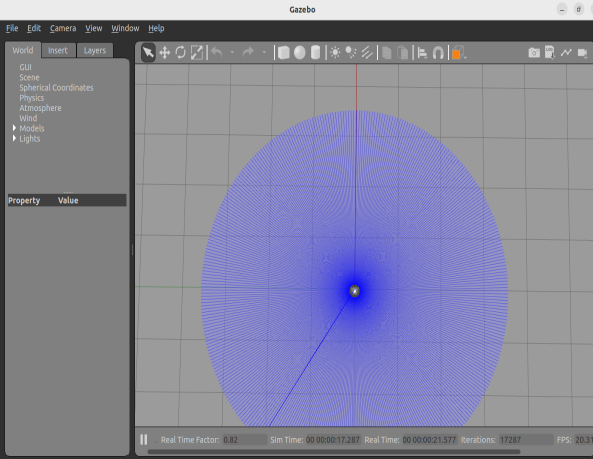
<br>

3. Now, Let's try if Virtual Machine is able to detect your camera!

```bash
ls /dev/video*
```

4. You should be able to see a list of /dev/video

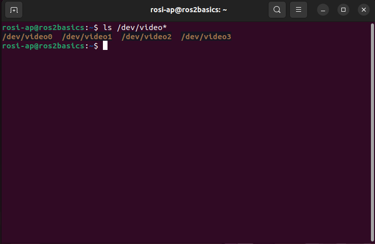
<br>

5. Update Ubuntu

```bash
sudo apt update
sudo apt upgrade
```

## Additional Installation on Virtual Machine

This section includes additional tools and packages that will enhance your learning experience throughout the course. While not strictly required, they are highly useful for hands-on practice and learning experience. 

**Note: Install these in your Virtual Machine!**

### Visual Studio Code (VSCode)

**Visual Studio Code or VSCode** is a lightweight, fast, and highly customizable code editor developed by Microsoft. It is widely used in the software development community due to its powerful features, extension support, and ease of use. For ROS 2 development, it offers useful features such as auto-completion for Python and ROS 2 client libraries, as well as static syntax error detection, making coding more efficient and error-free.

1. Download the `.deb` installer of VSCode Go to the official Visual Studio Code download page:

https://code.visualstudio.com/Download

- Click on ".deb" for Debian/Ubuntu under the Linux section.

2. Once the download has finished, Open a terminal by `ctrl` + `alt` + `T` install VSCode using the installer

```bash
cd ~/Downloads
sudo apt install ./code_*.deb
```

3. Execute this command to launch VSCode

```bash
code
```

### Install VSCode Extensions

1. In your VSCode Application, Go to the left panel and select `extensions`. Or you can `ctrl` + `shift` + `x`.

1. Install the following extensions

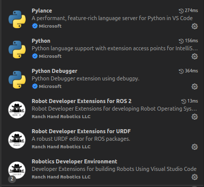  
<br> 

These extensions enhance your development experience by providing autocompletion and static syntax error detection for both Python code and ROS 2 libraries.

### Terminator

Terminator is a powerful terminal emulator that allows you to split your terminal window into multiple panes, making it easier to manage multiple terminal sessions side by side. This is especially useful when working with ROS 2, where you often need to run several nodes, tools, or commands at the same time.

1. To install Terminator, execute the following command in a terminal:

```bash
sudo apt install terminator
```
2. After installation, open another terminal by `ctrl` + `alt` + `T`.

3. Right click the terminal and split the terminal by clicking `Split Vertically` or `Split Horizontally`, depending on your preference.

4. You can use keyboard shortcuts to split the terminal quickly:

- **Split Vertically**: `Ctrl` + `Shift` + `E`
- **Split Horizontally**: `Ctrl` + `Shift` + `O`
- **Switch between panes**: `Ctrl` + `Tab`
- **Close a pane**:`Ctrl` + `Shift` + `W`

An example of Terminator use is shown below. In this course, you will use many terminals!

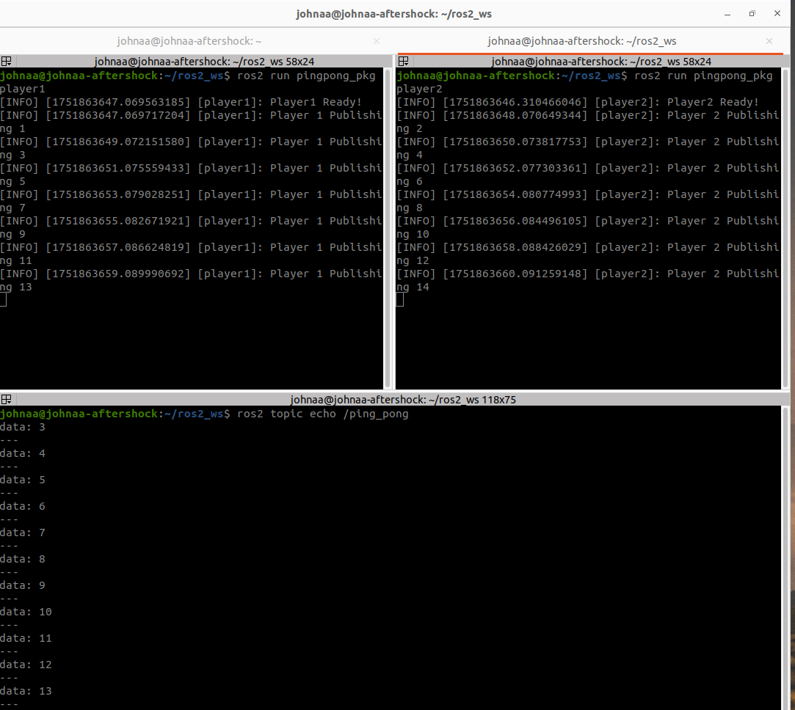  
<br> 


## Increasing CPU and RAM Allocation

### Virtual Machine Resource Allocation

### 🛠️ Virtual Machine Resource Allocation

To enhance your experience with the virtual machine, especially if you are using a powerful host system, you can increase the resource allocation to improve performance.

| **Resource** | **Minimum**         | **Recommended**          |
|--------------|---------------------|---------------------------|
| RAM          | 4000 MB (4 GB)      | 8000 MB (8 GB) or more    |
| CPU Cores    | 2 cores             | 4 cores or more           |


Follow these steps to optimize the virtual machine usage of your system resources:

1. Shut down your virtual machine. Go to top-right dropdown menu and `power off`

2. Increase `RAM Usage` of your Virtual Machine. However, make sure **not to exceed** the green zone in the VirtualBox settings.  
Allocating more than the recommended limit may cause your host system to become unstable or crash.

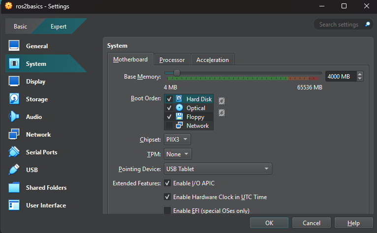  
<br> 

3. Increase `CPU Usage` of your Virtual Machine. However, make sure **not to exceed** the green zone in the VirtualBox settings.  
Allocating more than the recommended limit may cause your host system to become unstable or crash.

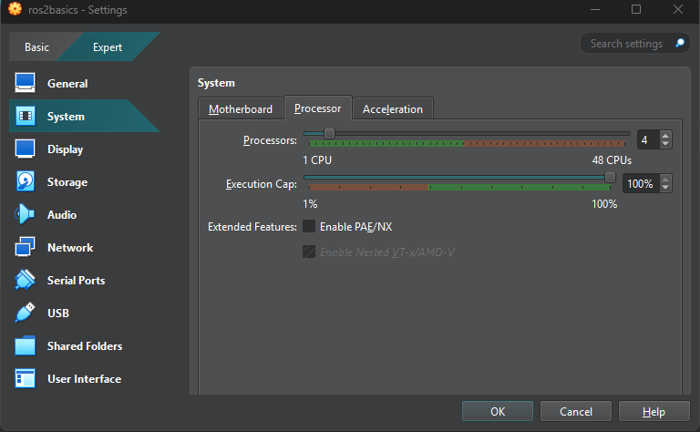  
<br> 

**This step is highly recommended if your system has a dedicated GPU. You may skip it if your system does not include one.**

4. Tick the box `Enable 3D Acceleration`. Increase `Video Memory Usage` of your Virtual Machine to **128 MB (Minimum)**. However, make sure **not to exceed** the green zone in the VirtualBox settings.  
Allocating less/more than the recommended limit may cause your host system to become unstable or crash.

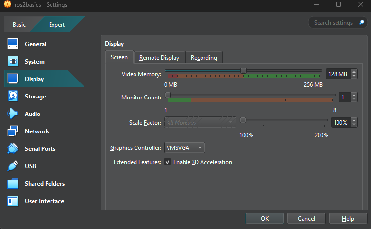  
<br> 

Now, Rerun your the simulation from the [verification step](#verification-of-virtual-machine). The Frame Per Second (FPS) indicated at bottom-right should be ~50-60 FPS!